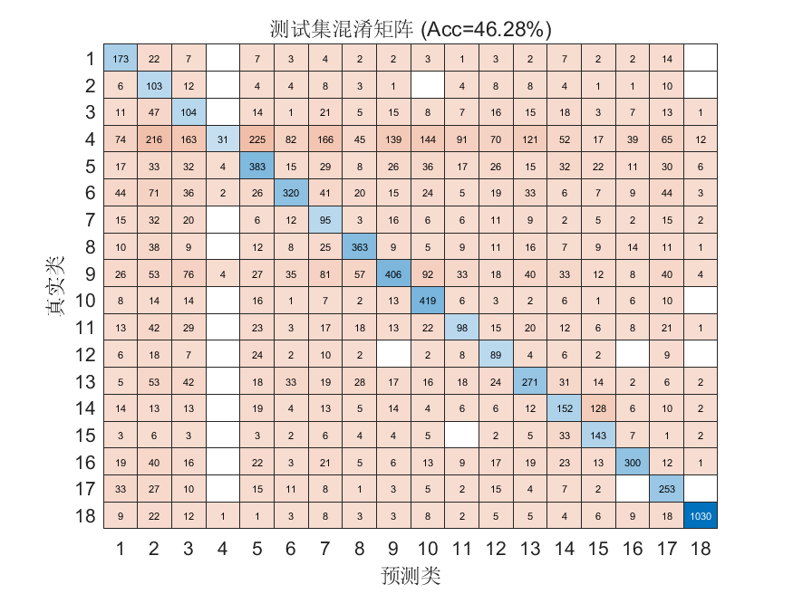

# FlowPic ResNet 实验总结

**时间**：17-Apr-2026 23:03:29  
**测试准确率**：46.28%  
**训练时长**：27.6 分钟

## 超参数
- Epochs: 150
- Batch Size: 128
- Learning Rate: 0.000500
- L2: 0.000100
## 数据集分布
见 `dataset_distribution.csv`

## 可视化

# 实验结果分析
1）你的数据增强里，有两种操作对 FlowPic 这种“时间直方图”是不合适的
---
提出新改进 _safe_aug
---

你现在对训练集做了：

circshift(img, [shift shift 0])
fliplr(img)

还会随机把某个通道清零。

这在自然图像里可能还能接受，但在 FlowPic 里，横轴本质上是时间。
fliplr 相当于把时间倒放，像把“先发生握手、再发生数据传输”改成“先传数据、再握手”；
circshift 更糟，它会把边缘“卷”到另一边，相当于把流开头的行为移到末尾，造出一种现实里不会出现的流量时序。

这就像你在教模型认交通轨迹，结果训练时把“从起点到终点”的路线一会儿左右翻转、一会儿首尾拼接。模型最后学到的不是规律，而是噪声。

2）你把很多“绝对量信息”抹掉了

你代码里先做了 log1p(X)，这一步本身没问题，是为了压缩直方图计数的长尾分布。
但后面你又对每个样本、每个通道单独归一化到 [0,1]。

这会带来一个很大的副作用：

一条很大的流和一条很小的流，只要形状相似，归一化后就会长得很像。

也就是说，模型原本可以利用的“流量强弱、包数规模、突发程度”这些绝对信息，被你冲淡了。

更关键的是，generate_flowpic.m 里 IAT 通道的 bin 边界是按每条流自己的 95 分位数动态生成的：
每个 flow 都会重新算一个 iat_max，再据此生成自己的 iat_edges。

这意味着：

同样是 0.02s 的包间隔
在 flow A 里可能落到第 6 个 bin
在 flow B 里可能落到第 12 个 bin

模型看到的表面都是“图”，但这些图的坐标尺子其实不统一。
这就像你拿不同刻度的尺子量东西，再把结果都画到同一张图上，模型当然会很难学。

3）特征表达本身压缩得有点狠

你的 FlowPic 是 32×32×4，并且只保留 前 15 秒 的数据。load_mirage_json.m 里也在预处理时把流截到 15 秒，并过滤掉少于 10 个包的流。

这会导致两个问题：

第一，很多细粒度时序信息被压扁了。
32 个时间 bin 去装 15 秒，平均每个 bin 接近半秒；对一些应用来说，很多关键节奏都已经糊掉了。

第二，FlowPic 本身非常稀疏。你的代码注释里自己也写了，直方图计数值是“大量 0，少量大值”的不均匀分布，所以才专门加了 log1p。

这类输入本来就不如自然图像“纹理丰富”，再配上不合适的增强和单样本归一化，很容易出现现在这种：
有些类能学到轮廓，有些类直接分不清。