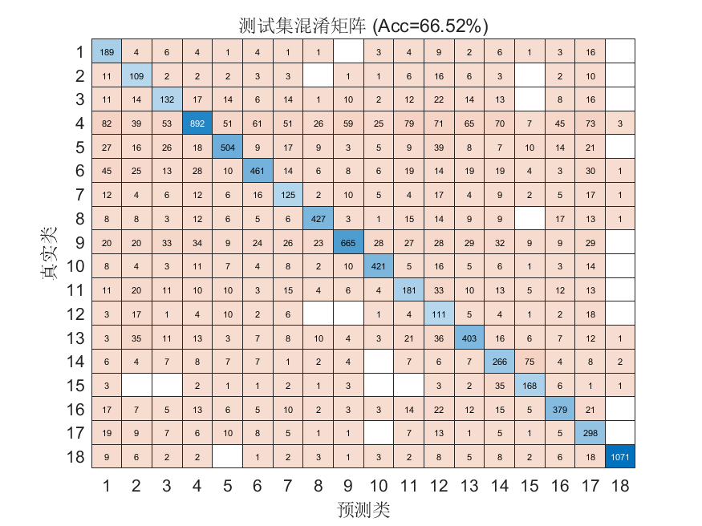

# FlowPic ResNet 实验总结

**时间**：18-Apr-2026 12:15:01  
**测试准确率**：66.52%  
**训练时长**：40.9 分钟

## 超参数
- Epochs: 150
- Batch Size: 128
- Learning Rate: 0.000500
- L2: 0.000100
## 数据集分布
见 `dataset_distribution.csv`

## 可视化

