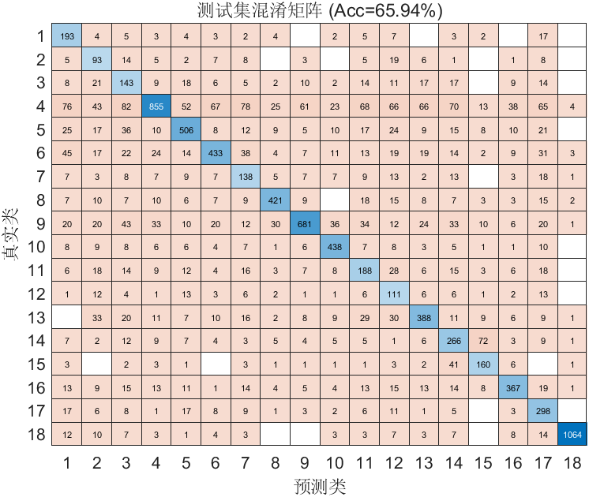

# FlowPic ResNet 实验总结

**时间**：07-May-2026 17:48:13  
**测试准确率**：65.94%  
**训练时长**：18.4 分钟

## 超参数
- Epochs: 150
- Batch Size: 128
- Learning Rate: 0.000500
- L2: 0.000100

## 数据集分布
详见 `dataset_distribution.csv`

## 可视化
- 训练曲线图未成功捕获（不影响模型训练与结果保存）

