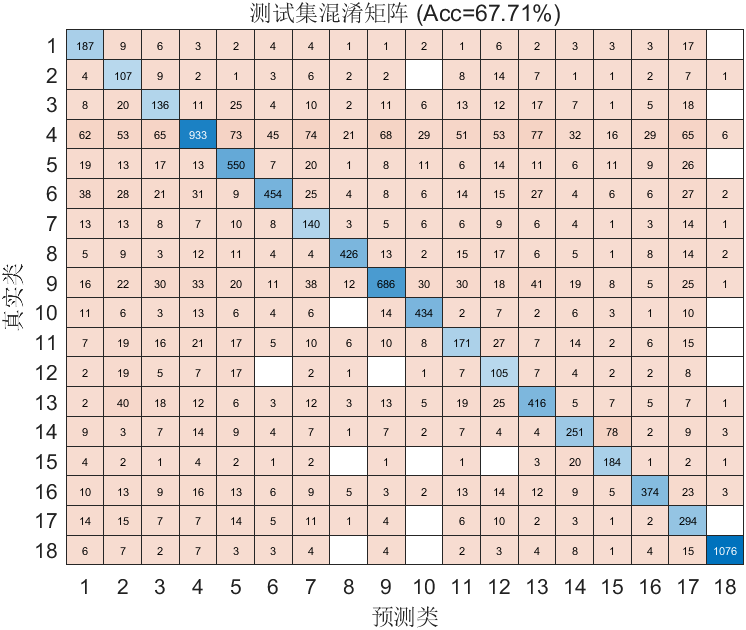

# FlowPic ResNet 实验总结

**时间**：07-May-2026 18:56:53  
**测试准确率**：67.71%  
**训练时长**：24.8 分钟

## 改进内容
- 在残差块内部加入dropout层

## 超参数
- Epochs: 150
- Batch Size: 128
- Learning Rate: 0.000500
- L2: 0.000100

## 数据集分布
详见 `dataset_distribution.csv`

## 可视化
- 训练曲线图未成功捕获（不影响模型训练与结果保存）

## 改进效果
- 测试集准确率上升3%

## 改进建议
- 优化FlowPic结构，目前32*32*4经过下采样之后信息损失严重

