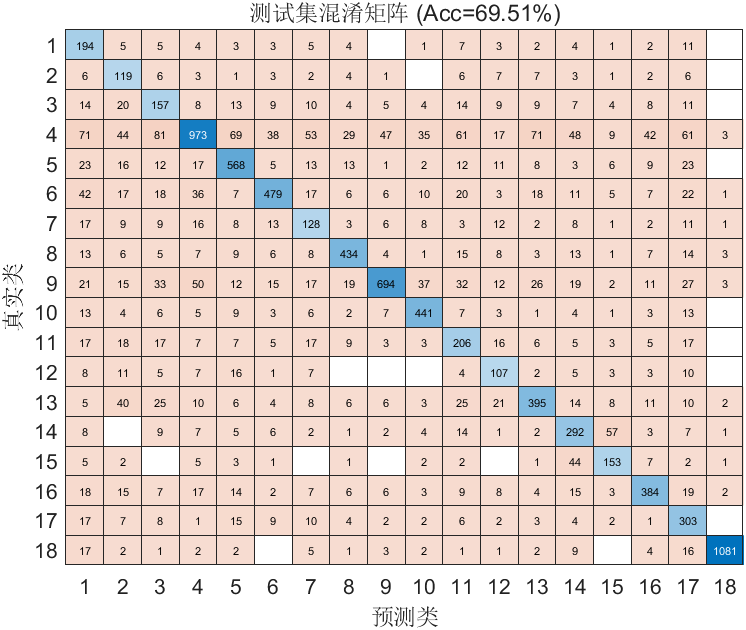

# FlowPic ResNet 实验总结

**时间**：09-May-2026 20:43:35  
**测试准确率**：69.51%  
**训练时长**：77.9 分钟

## 改进内容
- 将FlowPic改为48*48 且用single单精度浮点数表示

## 超参数
- Epochs: 150
- Batch Size: 64
- Learning Rate: 0.000500
- L2: 0.000100

## 数据集分布
详见 `dataset_distribution.csv`

## 可视化
- 训练曲线图未成功捕获（不影响模型训练与结果保存）

## 改进效果
- 模型效果还是70%左右

## 改进建议
- 从结果来看，64*64与48*48的效果对模型的准确率都没有较大提升
- 换回原来的32*32，再进行调整
