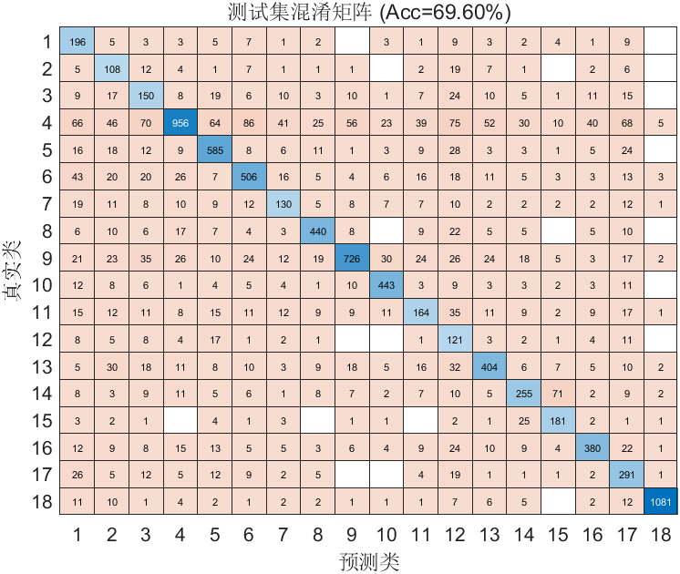

# FlowPic ResNet 实验总结

**时间**：09-May-2026 22:21:03  
**测试准确率**：69.60%  
**训练时长**：19.6 分钟

## 改进内容
- 改回了32*32的参数配置
- 和论文模型再参数上进行了对齐改进

## 超参数
- Epochs: 50
- Batch Size: 128
- Learning Rate: 0.001000
- L2: 0.000100

## 数据集分布
详见 `dataset_distribution.csv`

## 可视化
- 训练曲线图未成功捕获（不影响模型训练与结果保存）

## 改进效果
- 训练时间变短，准确率接近70%

## 改进建议
- 优化数据集

