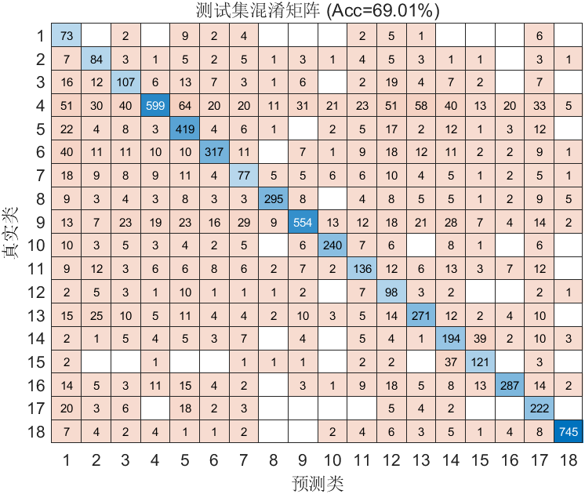

# FlowPic ResNet 实验总结

**时间**：09-May-2026 23:00:45  
**测试准确率**：69.01%  
**训练时长**：10.0 分钟

## 改进内容
- 对数据集进行了 零长度包过滤

## 超参数
- Epochs: 50
- Batch Size: 128
- Learning Rate: 0.001000
- L2: 0.000100

## 数据集分布
详见 `dataset_distribution.csv`

## 可视化
- 训练曲线图未成功捕获（不影响模型训练与结果保存）

## 改进效果
- 测试集结果有所提升，但是提前终止了迭代，且记录的测试准确率不准确

## 改进建议
- 查找问题所在

