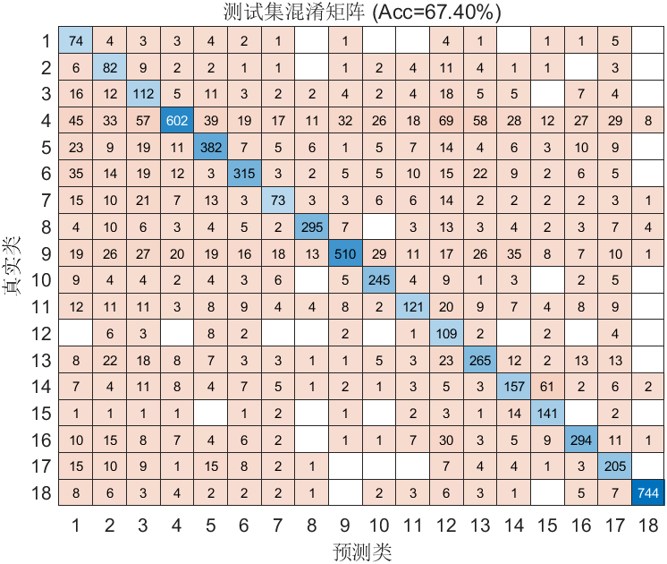

# FlowPic ResNet 实验总结

**时间**：09-May-2026 23:47:04  
**训练结果对比**：
- Loss 最低：第 5256 轮  Loss=0.7755  对应准确率=67.90%
- 准确率最高：第 14016 轮  Acc=70.52%  对应Loss=0.8604
**训练时长**：17.9 分钟

## 改进内容
- 同时引入loss最低和准确率最高两个参数

## 超参数
- Epochs: 50
- Batch Size: 128
- Learning Rate: 0.001000
- L2: 0.000100

## 数据集分布
详见 `dataset_distribution.csv`

## 可视化
- 训练曲线图未成功捕获（不影响模型训练与结果保存）

## 改进效果
- 因为随机性和类别不均衡问题，导致二者不是在同一轮次出现

## 改进建议

