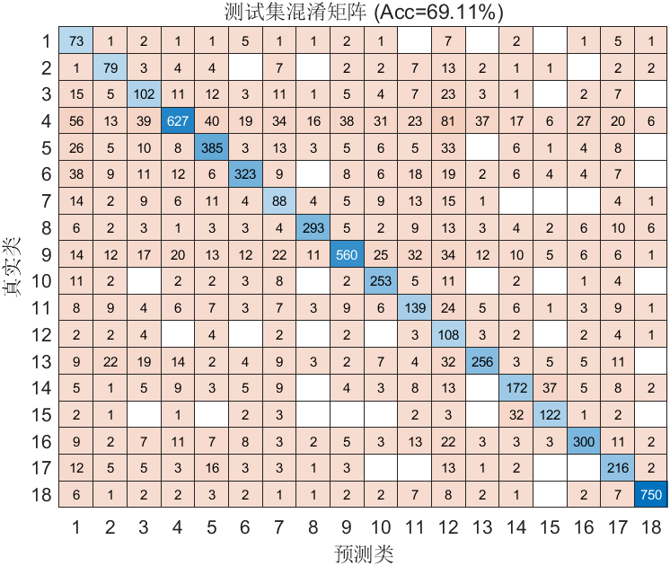

# FlowPic ResNet 实验总结

**时间**：10-May-2026 11:00:21  
**测试准确率**：69.11%  
**训练时长**：18.7 分钟

## 改进内容
- 引入LR分段衰减，在25轮之后lr从0.001减到0.0001

## 超参数
- Epochs: 50
- Batch Size: 128
- Learning Rate: 0.001000
- L2: 0.000100

## 数据集分布
详见 `dataset_distribution.csv`

## 可视化
- 训练曲线图未成功捕获（不影响模型训练与结果保存）

## 改进效果
- 从训练结果可以看出，训练集和验证集的准确率确实有所提升，但是测试集的准确率并无变化，并且loss值一直在上升

## 改进建议
- 减小过拟合现象影响

