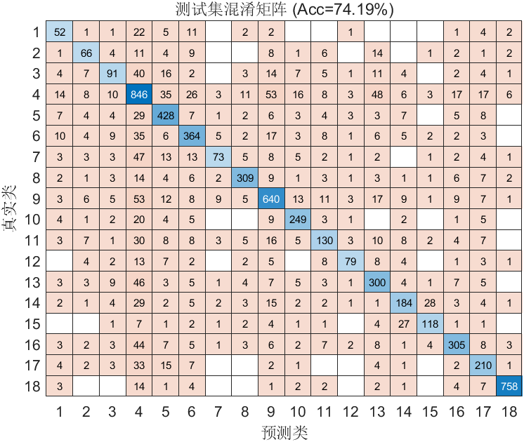

# FlowPic ResNet 实验总结

**时间**：10-May-2026 12:42:01  
**测试准确率**：74.19%  
**训练时长**：29.4 分钟

## 训练过程最优结果

| 指标 | 迭代次数 | 数值 | 对应另一指标 |
|------|----------|------|--------------|
| Loss 最低   | 第 12702 次迭代 | 0.9255 | 准确率 73.56% |
| 准确率最高  | 第 16206 次迭代 | 73.75% | Loss 0.9346 |

> 当前保存模型来自 Loss 最低轮次（第 12702 次迭代）。
> 若两者不在同一迭代，说明模型在该轮判对更多但部分错误更自信。

## 改进内容
- 去除类别权重：类别权重有时会干扰正常的梯度方向

## 超参数
- Epochs: 50
- Batch Size: 128
- Learning Rate: 0.001000
- L2: 0.000500

## 数据集分布
详见 `dataset_distribution.csv`

## 可视化
- 训练曲线图未成功捕获（不影响模型训练与结果保存）

## 改进效果
- 测试集准确率达到74%，模型相比之前有了较大提升

## 改进建议
- 和原论文相比，模型的训练量因为移除零长度包训练量减小，试着进行数据增强

