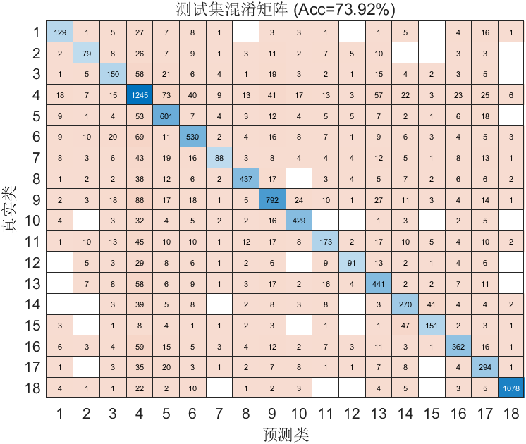

# FlowPic ResNet 实验总结

**时间**：10-May-2026 13:48:33  
**测试集准确率**：73.92%  
**训练时长**：53.6 分钟

## 训练过程最优结果

| 指标 | 迭代次数 | 数值 | 对应另一指标 |
|------|----------|------|--------------|
| Loss 最低   | 第 22320 次迭代 | 0.9169 | 准确率 73.29% |
| 准确率最高  | 第 27900 次迭代 | 73.47% | Loss 0.9297 |

> 当前保存模型来自 Loss 最低轮次（第 22320 次迭代）。
> 若两者不在同一迭代，说明模型在该轮判对更多但部分错误更自信。

## 改进内容
- 最小包数阈值调小，扩大数据量

## 超参数
- Epochs: 50
- Batch Size: 128
- Learning Rate: 0.001000
- L2: 0.000500

## 数据集分布
详见 `dataset_distribution.csv`

## 可视化
- 训练曲线图未成功捕获（不影响模型训练与结果保存）

## 改进效果
- 与之前相比无明显增长变化

## 改进建议
- 回退到上一版代码参数，尝试增大训练轮数进行对比试验

